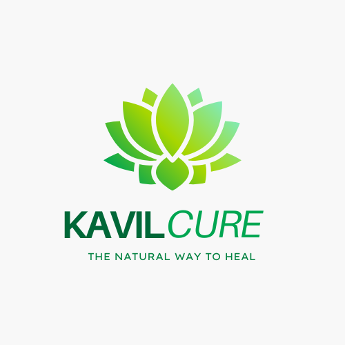

# 🌿 Kavil-Cure: Ayurvedic Jaundice Treatment Platform 🌿

  

## 📋 Project Overview

Kavil-Cure is a comprehensive healthcare platform focused on providing accessible and affordable Ayurvedic treatment for Jaundice (Kavil/Kamini). Developed during the **Developer Social (Formerly Script Foundation) Hackathon - Social Summer of Code Season 3**, this platform bridges the gap between traditional Ayurvedic remedies and modern healthcare accessibility.

## ✨ Key Features

- 🏥 **Online Appointment Booking**: Book consultations with Ayurvedic healthcare specialists
- 🚚 **Medication Delivery Service**: Reliable delivery for patients with mobility challenges or remote locations
- 📱 **User-Friendly Interface**: Responsive design accessible from any device
- 💰 **Affordable Treatment**: Cost-effective alternatives to conventional hospital treatments
- 📍 **Multiple Locations**: Service centers across Maharashtra for wider accessibility
- 📊 **Transparent Pricing**: Clear pricing structure based on location
- 📝 **Professional Healthcare Content**: Credible information written by Ayurvedic experts

## 🛠️ Tech Stack

- **Frontend**: HTML, CSS, JavaScript
- **Styling**: Tailwind CSS
- **Responsive Design**: Mobile and desktop optimized
- **Backend**: PHP
- **Database**: RDBMS (MySQL), XAMPP

## 🔍 Project Structure

- 📄 **Homepage**: Introduction to services and benefits
- 📄 **Treatment Page**: Detailed information about Jaundice treatment
- 📄 **Contact Page**: Easy communication with healthcare providers
- 📄 **About Page**: History and credentials of the service
- 📄 **Login/Sign-Up**: User account management

## 🚀 Project Highlights

- **45+ Years Legacy**: Trusted treatment with proven results since 1930
- **2.5M+ Patients**: Successfully treated over 2.5 million patients
- **100% Ayurvedic**: Pure herbal remedies without side effects
- **24/7 Availability**: Healthcare access whenever needed
- **3 Service Centers**: Located in Mumbai, Navi Mumbai and Islampur (HQ)

## 🏆 Achievements

This project was developed as part of the **Developer Social (Formerly Script Foundation) Hackathon - Social Summer of Code Season 3**, where it was recognized for:

- 🌟 Improving healthcare accessibility in rural and urban areas
- 🌟 Preserving traditional Ayurvedic knowledge through technology
- 🌟 Creating a scalable platform for affordable healthcare

👉 [View the complete project submission and details on the SSOC Devfolio Platform](https://devfolio.co/projects/kavil-cure-ayurvedic-jaundice-startup-website-09c8)

## 👥 Target Audience

- Jaundice patients seeking affordable treatment
- Individuals preferring natural/Ayurvedic remedies
- Patients with limited access to healthcare facilities
- People looking for alternatives to expensive hospital treatments

## 🔮 Future Enhancements

- 🌐 Expansion to additional locations
- 📊 Patient tracking and recovery dashboard
- 🗣️ Multilingual support for regional languages
- 📱 Native mobile applications

## 🔗 Contact & Support

- **Email**: aatmajsalunke@yahoo.com
- **Phone**: +91 9766227792

  

---

Made with ❤️ and Care by [@Aatmaj](https://www.linkedin.com/in/aatmaj-salunke-7106041b0/)
