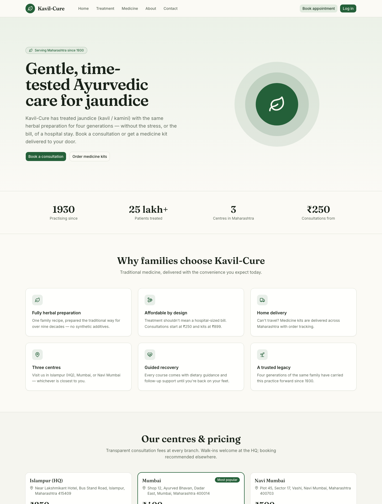

# 🌿 Kavil-Cure — Ayurvedic Jaundice Care Platform

A full-stack healthcare platform for a family-run Ayurvedic jaundice (kavil / kamini) practice in Maharashtra: online consultation booking, medicine-kit ordering with order tracking, and a clinic admin panel.



## The story

The original version of this site was built for the **Developer Social (formerly Script Foundation) Hackathon — Social Summer of Code Season 3** as one of my first full-stack projects: static HTML pages styled with Tailwind via CDN ([project submission on Devfolio](https://devfolio.co/projects/kavil-cure-ayurvedic-jaundice-startup-website-09c8)). That version is preserved in [`legacy/`](legacy/).

This is the ground-up rebuild: a real database, real authentication, working booking and ordering flows, and a redesigned UI.

## Features

**Public site**
- Home, treatment, about, and contact pages with a custom design system (deep botanical green + warm cream palette, Fraunces/Inter type pairing)
- Working contact form persisted to the database
- Branch listing with transparent consultation pricing (₹)
- Medical disclaimer and honest, softened health claims

**Patients**
- Email/password auth (better-auth) with session-gated routes
- Book consultations: pick a centre, date, and time slot — already-booked slots are disabled live
- Order medicine kits: quantity → delivery address → demo payment → order confirmation
- Dashboard with appointments (cancellable) and orders with a live tracking timeline (placed → confirmed → shipped → out for delivery → delivered)

**Clinic admin** (role-based)
- Manage appointments (complete / cancel)
- Advance orders through the fulfilment pipeline; every change is recorded as a tracked status event
- Read and triage contact messages

## Tech stack

| Layer     | Choice                                                        |
| --------- | ------------------------------------------------------------- |
| Framework | Next.js 16 (App Router, Server Components, Server Actions)    |
| Language  | TypeScript                                                     |
| UI        | Tailwind CSS v4 + shadcn/ui (Radix), lucide-react icons        |
| Database  | PostgreSQL (Neon) via Prisma ORM                               |
| Auth      | better-auth (email/password, sessions, role-based access)      |
| Validation| Zod                                                            |

The payment step is an intentional mock (this is a portfolio project) — the server action is structured so a real gateway (Stripe / Razorpay) can slot in where the mock reference is generated.

## Getting started

```bash
npm install
cp .env.example .env          # set DATABASE_URL (any Postgres — Neon free tier
                              # works) and a real BETTER_AUTH_SECRET
npx prisma migrate deploy     # creates the tables
npx prisma db seed            # branches, products, demo users, sample data
npm run dev                   # http://localhost:3000
```

**Demo accounts** (created by the seed):

| Role    | Email                  | Password   |
| ------- | ---------------------- | ---------- |
| Patient | patient@kavilcure.com  | patient123 |
| Admin   | admin@kavilcure.com    | admin1234  |

## Project structure

```
prisma/               schema + migrations + seed
src/
  app/                routes (public pages, /book, /order, /account, /admin, /api)
  components/         site chrome, forms, timeline, shadcn/ui primitives
  lib/                prisma client, auth config, session helpers, constants
  lib/actions/        server actions (contact, appointments, orders, admin)
  proxy.ts            optimistic auth gate for protected routes
legacy/               the original 2022 static-HTML version, kept for posterity
```

## Roadmap

- Real payment gateway (Stripe / Razorpay) behind the existing checkout action
- Multilingual support (Marathi / Hindi)
- Email notifications for bookings and order status changes
- Deploy on Vercel with Postgres (Neon/Supabase)

## Disclaimer

Kavil-Cure offers traditional Ayurvedic support and is not a substitute for professional medical advice, diagnosis, or treatment. Jaundice can indicate a serious underlying condition — always consult a qualified physician.

---

Made with ❤️ by [Aatmaj Salunke](https://www.linkedin.com/in/aatmaj-salunke-7106041b0/)
